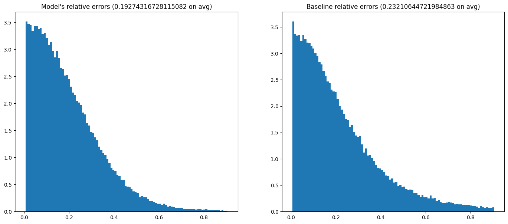
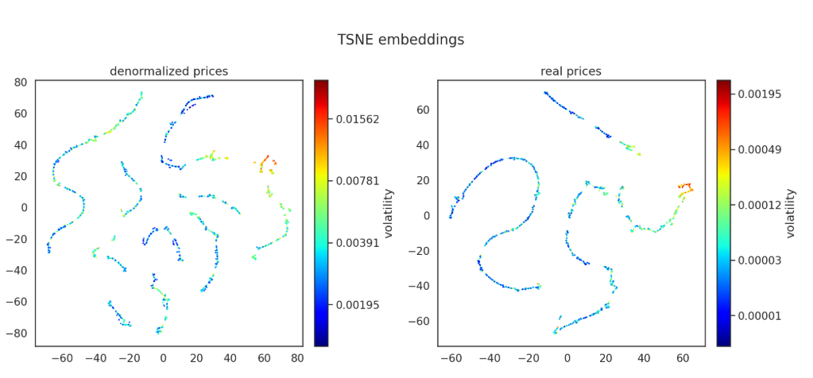
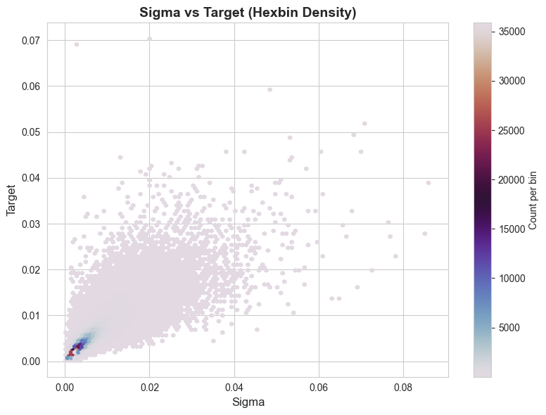
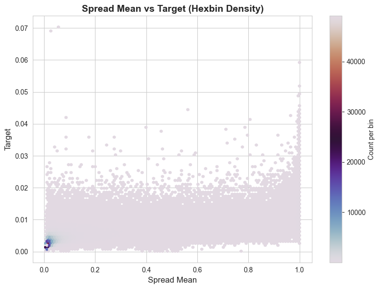
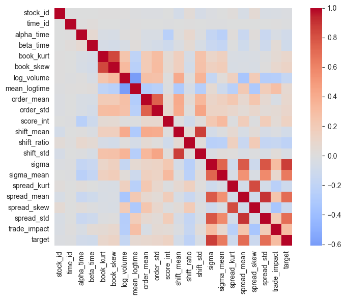
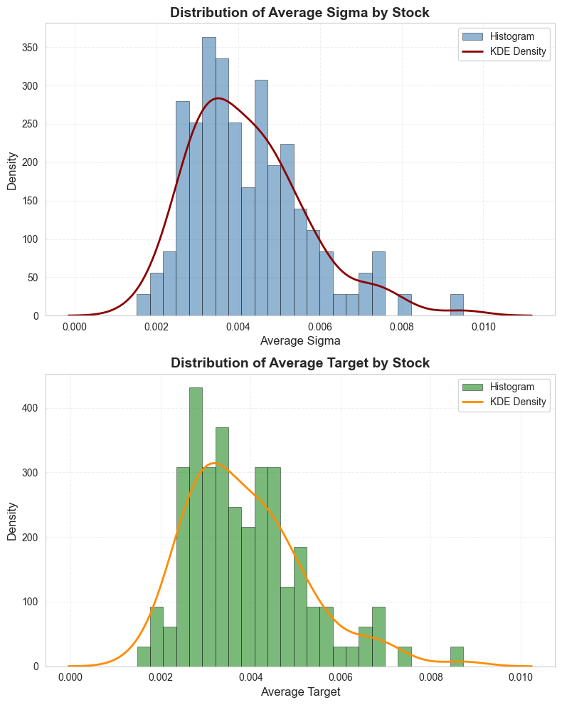

# Optiver Realized Volatility Prediction

Volatility is a measurement of how varied the returns of a given security or market index are over time. It is measured from the standard deviation of the securities returns over set time.

The aim of the project was to predict, to the best of our ability the volatility of given stocks over the span of `10` minutes, from the market snapshots over previous `10`. The stocks are masked by their `stock_id`.

This project is based on the following kaggle competition with $100k total prize pool:\
https://www.kaggle.com/competitions/optiver-realized-volatility-prediction

# The Goal

As the competition had ended four years ago we could not test our results through the website.\
We had decided to introduce a `85 : 15 | train : test` split

The best scores in the competition were around `0.195`.\

There, unfortunately, was a way to reorder `time_id`'s chronologically, which gave a significant advantage by allowing inference from the future.
We decided to not apply such methods as they conflicted with the whole purpose of this project. 

On a side note, the task of inferring the actual order of deliberately scrambled `time_id`'s is interesting in its own right. It seems reasonable to assume that the feature vectors lie on a 1-dimensional manifold in some very high-dimensional space. Applying a more sophisticated non-linear dimensionality reduction, like `UMAP`, clearly showed this. Then, ordering the data by the x-axis in the $2d$ embedding yielded the correct timeline.)

The best scores without such methods hover around `0.21`.\
Many employ advanced machine learning techniques with models trained over days on powerful GPU's.

At the start of the project we decided we'd conisder it a great success if we ended up in the middle of the leaderboard.

- `Q1` score: `0.22322`
- `Q2` score: `0.22755`
- `Q3` score: `0.24188`

# Dataset Files Overview

#### 1. `book_train.parquet`
A parquet file partitioned by `stock_id`. It contains order book data showing the most competitive buy and sell orders entered into the market. The top two levels of the order book are included:
- **First level**: More competitive in price, receiving execution priority.
- **Second level**: Less competitive in price, with lower execution priority.

##### Key Columns:
- `stock_id`: ID code for the stock. Note that not all stock IDs appear in every time bucket.
- `time_id`: ID code for the time bucket. Time IDs are consistent across all stocks, though not necessarily sequential.
- `seconds_in_bucket`: Number of seconds from the start of the bucket, always starting at 0.
- `bid_price[1/2]`: Normalized prices for the most (1) and second most (2) competitive buy levels.
- `ask_price[1/2]`: Normalized prices for the most (1) and second most (2) competitive sell levels.
- `bid_size[1/2]`: Number of shares on the most (1) and second most (2) competitive buy levels.
- `ask_size[1/2]`: Number of shares on the most (1) and second most (2) competitive sell levels.

#### 2. `trade_train.parquet`
A parquet file partitioned by `stock_id`. It contains data on executed trades. Since trade data is more sparse than order book updates, there are usually fewer rows.

##### Key Columns:
- `stock_id`: Same as in `book_train.parquet`.
- `time_id`: Same as in `book_train.parquet`.
- `seconds_in_bucket`: Same as in `book_train.parquet`, though this field may not always start from 0 due to trade sparsity.
- `price`: Average price of executed trades during one second, normalized and weighted by the number of shares traded in each transaction.
- `size`: Total number of shares traded in that second.
- `order_count`: Number of unique trade orders executed in that second.

#### 3. `train.csv`
This file contains the ground truth values for training.

##### Key Columns:
- `stock_id`: Same as above, but loaded as an integer column in this CSV format.
- `time_id`: Same as above.
- `target`: The realized volatility over the 10-minute window following the feature data for the same `stock_id` and `time_id`. There is no overlap between feature data and target data.

# Processing the Data

- The `book_train` dataset was ridiculously length `~167M` rows.
- The `trade_train` dataset was still heavy `~38M` rows
- There were `~429K` pairs of`stock_id`, `time_id` in the `train` dataset.

First thing we did was we merged the trades df by adding the book snapshot immediately before and after this trade happened.\
This allowed us to work on the smaller dataframe while still using crucial information from the book.

The notebook used was `data_process.ipynb`. The kernel crashed multiple times during this lengthy operation,
my laptop's `32GB` of ram were not enough. We managed to fix the issue by increasing my `swap file` memory to `50GB`.

# Data Cleanup

Having this dataset in `data_cleanup.ipynb` we removed rows with missing values in `trades` and the ones for which the merge couldn't be completed. The ones for which there was no book record before the trade happened.

We had computed the volatility in the previous 10 minutes from this data as we believed it will be the single most predictive feature aggregating it into the `train` dataset for which we will later develop models.

We also aggregated into it following features: 
- Current spread
- Current mid
- The direction of the trade
- Maximal time difference between book updates
- Sum of all order sizes in the last 10 minutes

# Baseline Models

We decided to code following models:

- Linear Regression `...` | Loss: `0.36642` | Issues: It's a linear regression, no embedding,
- XGBRegressor `3000,3`| Loss: `0.29148` | Issues: None! I love XGB, easy embeddings and simple to use
- Simple NN `64,3`| Loss: `0.30379` | Issues: No embedding yet, but high hope with more features

# Feature Engineering

Using educated trial and error methods we had ended up with the following 19 predictive features:
- `stock_id`, `time_id` as indices

For a particular pair stock_id, time_id's we aggregated the `trades` dataframe to include:
- Mean, std, skew and kurt of spread of particular stock. Intuitively with high spread the market is uncertain, hence more volatile.
- average number of trades when at least one happened in the given second, the standard deviation of previous, indicating how fast market reacts
- mean of logarithm of time between trades - how often the stock trades,
- log of the traded total volume (we had to recover original prices to do that)
- skew and kurtosis of the order book
- When trades had only one direction we had defined a product shift as the volume of these trades. We looked at mean of it and std
- Defined shift ratio as the ratio of product shift to total trade volume, to see what percent of volume the market is certain of future price
- Defined trade impact as the mean of how much a book sizes changed when a trade happened

Additionally to implement broader market movements we added:
- mean sigma of all other stocks, weighted by log volume
- The trend in the market volume by time, had to fit linear regression over all trades, without intercept second with
- The latter model's `R^2` score, we found that the easier the market is to predict the higher the volatility will be

# Interesting Plots

# Final Model

Considering the finickiness of financial data, characterised by a high noise-to-signal ratio and the proclivity to overfitting, we had a few options for our model architecture. Simple neural networks, random forests and boost-based models failed to significantly improve our predictions upon the baseline yielded by the realized volatility in the previous timeframe. Isolating the highly predictive `stock_id` feature was also problematic as it significantly reduced the training set. The models also proved prone to overfitting, and not expressive enough to capture the convoluted relationships in the data. To address these issues, we decided on a neural network with residual blocks to help the model separate the signal from noise. We also applied __layer norm__ to stabilise the training. This model showed a marked improvement, as adding $6$ basic features reduced the RMSPE from $0.36$ to $0.25$. Adding a simple embedding of the categorical `stock_id` feature further reduced it to $0.25$. Scaling the model slightly allowed the relatively few features found through careful engineering to achieve RMSPE at $0.23$.

## Alternative approaches

Training a recurrent neural network or a transformer yields rather poor performance. This is probably because such models are very data-hungry and, in the case of financial data, require careful hyperparameter-tuning. However, building an ensemble model encompassing a GRU model trained on raw tick data, a convolutional neural network and a residual neural network might further improve our baseline model. 

 # The Result

We ended up in!:
- top `46.8503937%` of all competitors
- while using merely `70%` of available data
- and only `19` model features
- in a few days without touching the university servers

### This we consider a great success!!
